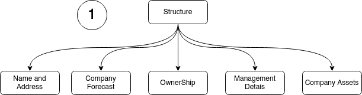
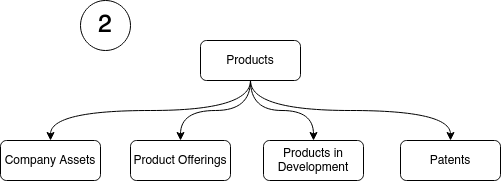
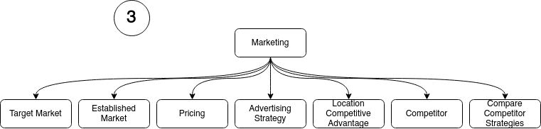
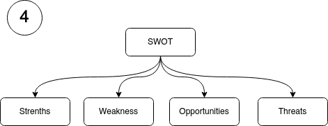
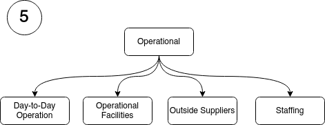
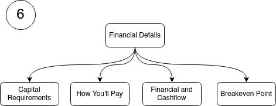
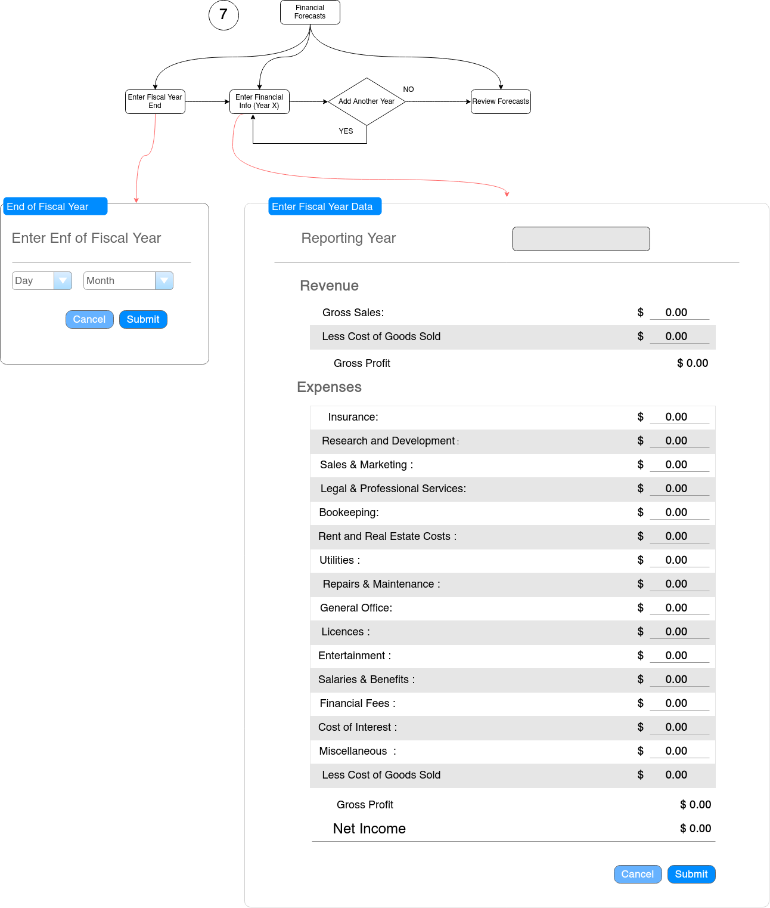
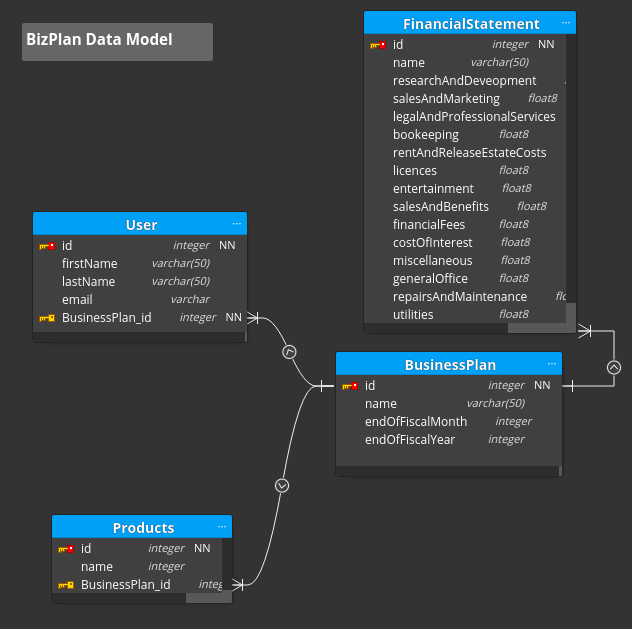

## How to Run Project
### create a virtualenv
$virtualenv env
### activate virtualenv
$source env/bin/activate
## install packages 
$pip3 install -r requirements.txt
### create database 
$python
>>> from project import db  
>>> db.create_all()
### run app
$python server.py

# Main Screen Flow

## Structure
Defines the business structure

## Products for the 
Defines the products the business is producing or is planning to produce

## Marketing
Target and established markets. Advertising strategy and others

## SWOT
SWOT analysis

## Operational
Day-to-day ops, facilities and staffing

## Financial Details
Defines the business structure

### Financial Statments
Includes financial statments for cashflow forecasting

## Data Model

