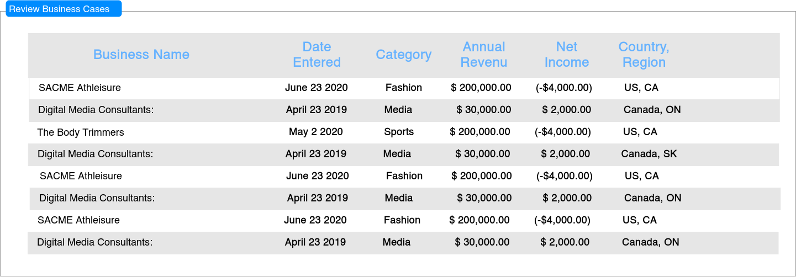

# BzPlan Dembe 
BzPlan Dembe is a webapp that brigdes the gap between investors and small business enterprenuers. It provides a platform for enterprenuers to develop and share their business plans and finantial forecasts. It uses machine learning to rank the business plans and recomend them to investors.

## Table of Contents
* [Overview](#Overview)
* [Tech Stack](#Tech-Stack)
* [Setup and installation](#Setup-and-installation)
* [Main Screen Flow](#Main Screen Flow)
* [Future Features](#Future-Features)

## Overview
Have you ever wondered how much your home would cost if it were in a different location?? well if you have, Zyzy is here for you. Zyzy is a fun web app that users can enjoy by finding out how much their home would cost if it where in a different location. The brain of the app was built using the gradient boasting machine learning algorithm. This included a long task of exploring and wrangling data, using pandas, matplotlib and seaborn. To make the best predictions, I explored three machine learning algorithmns as you will see in the demo to get a better feel of each one's contribution.
#### Usage
once the user gets to my homepage, I present to them the scope of the app(the available cities)
They are then required to provide features of their home and also to choose a city of interest. That information is then sent to a handler and is used to predict the price of their house.
In return they get the estimated price of their home in their chosen city and a few general statistics will be shown using chart.js 

## Tech Stack
Data Wrangling: Pandas, Numpy , seaborn, matplotlib  
Framework: Flask  
Backend: Python, SQLAlchemy, PostgreSQL ,SciKit_Learn  
Frontend: Javascript , AJAX, JSON , JQuery, Jinja, HTML, CSS, Bootstrap  
Libraries: D3.js, chart.js

### HOMEPAGE  
Below is muy landing page   

#### Get iformation about user's home  
On this page the users provide their home features   

   
### Provide estimate to the users 
Here the users recieve their home estimate and a few statistics  

   
## Setup and installation
On local machine, go to desired directory. Clone  repository:

$ git clone https://github.com/Claire-Kimbugwe/House_value_estimate  
Create a virtual environment in the directory:

$ virtualenv env 
Activate virtual environment: 

$ source env/bin/activate  
Install dependencies: 
$ pip install -r requirements.txt  
Create database:  

## How to Run Project
### create a virtualenv
$virtualenv env
### activate virtualenv
$source env/bin/activate
## install packages 
$pip3 install -r requirements.txt
### create database 
$python
>>> from project import db  
>>> db.create_all()
### run app
$python server.py

# Main Screen Flow

## Structure
Defines the business structure

## Products for the 
Defines the products the business is producing or is planning to produce

## Marketing
Target and established markets. Advertising strategy and others

## SWOT
SWOT analysis

## Operational
Day-to-day ops, facilities and staffing

## Financial Details
Defines the business structure

### Financial Statments
Includes financial statments for cashflow forecasting

## Review Business
Listing selectable list of business plans

## Data Model

