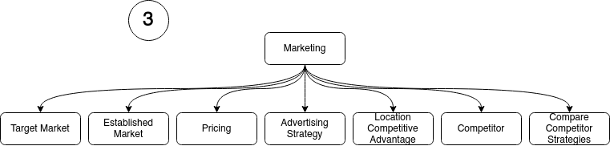

# Main Screen Flow

## Structure
Defines the business structure

## Products for the 
Defines the products the business is producing or is planning to produce

## Marketing
Target and established markets. Advertising strategy and others

## SWOT
SWOT analysis

## Operational
Day-to-day ops, facilities and staffing

## Financial Details
Defines the business structure

